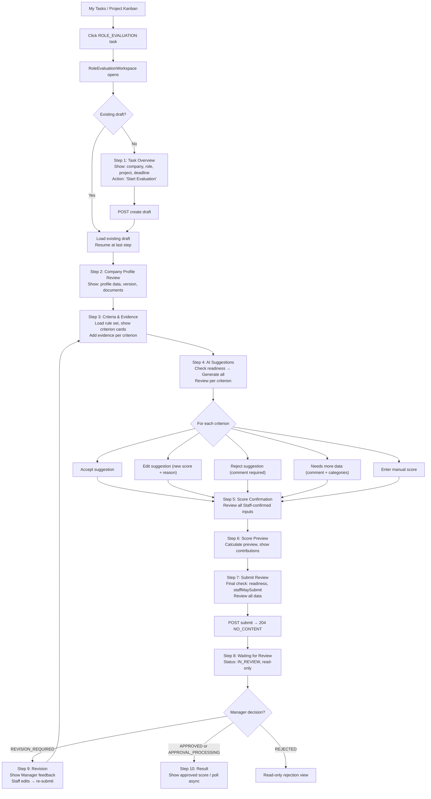
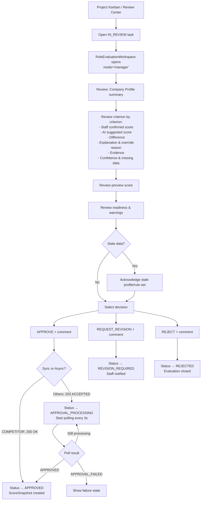

# APMS Role Evaluation Scoring Workflow — Audit & Implementation Plan

## Table of Contents
- [A. Current Architecture Audit](#a-current-architecture-audit)
- [B. API Contract Table](#b-api-contract-table)
- [C. End-to-End Staff Workflow](#c-end-to-end-staff-workflow)
- [D. End-to-End Manager Workflow](#d-end-to-end-manager-workflow)
- [E. Role-Specific Behavior Matrix](#e-role-specific-behavior-matrix)
- [F. Evaluation State / Action Matrix](#f-evaluation-stateaction-matrix)
- [G. Screen Map](#g-screen-map)
- [H. Component Tree](#h-component-tree)
- [I. Query & Mutation Plan](#i-query--mutation-plan)
- [J. Frontend Files to Create](#j-frontend-files-to-create)
- [K. Frontend Files to Modify](#k-frontend-files-to-modify)
- [L. API Contract Gaps](#l-api-contract-gaps)
- [M. Risks & Edge Cases](#m-risks--edge-cases)
- [N. Implementation Order](#n-implementation-order)

---

## A. Current Architecture Audit

### A.1 Backend Architecture

| Area | Finding |
|---|---|
| **Framework** | Spring Boot (Java), MongoDB + PostgreSQL (dual-store) |
| **Package** | `com.apms.domain.score` — controllers, DTOs, enums, services, entities |
| **Draft Storage** | MongoDB collection `role_evaluation_drafts` |
| **Score Storage** | PostgreSQL table `score_snapshots` (JPA) |
| **Approved Versions** | MongoDB collection `role_evaluation_versions` |
| **Outbox Events** | MongoDB — drives async post-approval processing |
| **Auth** | Spring Security with `@PreAuthorize` — role-based (e.g. `SYSTEM_ADMIN`, `BUSINESS_DEVELOPMENT_STAFF`, `RESEARCH_STAFF`, `BUSINESS_DEVELOPMENT_MANAGER`) |

### A.2 Frontend Architecture

| Area | Finding |
|---|---|
| **Framework** | React 18 + TypeScript + Vite |
| **Routing** | **No React Router** — custom state-based page switching via `activePage` in `localStorage` |
| **Navigation** | `setActivePage(key)` from `UserContext` — no URL changes, no deep linking |
| **State Mgmt** | Local `useState`/`useEffect` + custom `useApiQuery`/`useApiMutation` hooks |
| **HTTP Client** | Native `fetch` wrapper in [api.ts](file:///d:/APMS/apms-react/src/services/api.ts) (not Axios) |
| **Auth** | JWT in `localStorage`, auto-refresh on 401 |
| **Icons** | `lucide-react` |
| **Animations** | `framer-motion` |
| **Charts** | Custom SVG components in [Charts.tsx](file:///d:/APMS/apms-react/src/components/charts/Charts.tsx) |
| **Styling** | Vanilla CSS / CSS Modules |
| **Roles** | 6 roles: `ADMIN`, `OWNER`, `DIRECTOR`, `MANAGER`, `KEY_MEMBER`, `STAFF` |

### A.3 Existing Evaluation Flow (What Already Exists)

> [!IMPORTANT]
> A `RoleEvaluationWorkspace` component already exists at [RoleEvaluationWorkspace.tsx](file:///d:/APMS/apms-react/src/components/RoleEvaluationWorkspace.tsx) (~2,800 lines). It is embedded inside [ProjectDetailPage.tsx](file:///d:/APMS/apms-react/src/pages/ProjectDetailPage.tsx) and opened when a task of type `ROLE_EVALUATION` is clicked.

**What works:**
1. ✅ Task → Evaluation linkage: `ProjectTaskResponse` includes `evaluationId`, `targetCompanyProfileId`, `evaluatedRole`
2. ✅ Draft creation via `POST /projects/{projectId}/tasks/{taskId}/role-evaluations`
3. ✅ Existing draft detection via `getTaskDrafts()`
4. ✅ Rule set loading via `getRuleSets(role, active)`
5. ✅ Criterion input update via `PATCH /role-evaluations/{evaluationId}/criteria/{criterionKey}`
6. ✅ Evidence addition via `POST /role-evaluations/{evaluationId}/evidence`
7. ✅ Suggestion generation (single + batch)
8. ✅ Accept/Reject/Needs-more-data suggestion actions
9. ✅ Readiness check via `GET /role-evaluations/{evaluationId}/readiness`
10. ✅ Preview calculation via `POST /role-evaluations/{evaluationId}/calculate-preview`
11. ✅ Submit via `POST /role-evaluations/{evaluationId}/submit`
12. ✅ Manager review via `POST /role-evaluations/{evaluationId}/review` with Idempotency-Key
13. ✅ Polling for `APPROVAL_PROCESSING` status
14. ✅ Official score retrieval via `GET /profiles/{companyProfileId}/role-scores`
15. ✅ All backend API functions defined in [roleEvaluationApi.ts](file:///d:/APMS/apms-react/src/API/roleEvaluationApi.ts)
16. ✅ All TypeScript types properly defined in [domain.ts](file:///d:/APMS/apms-react/src/types/domain.ts)
17. ✅ Wizard-style step navigation in workspace

**What is broken or incomplete:**

| Issue | Severity | Details |
|---|---|---|
| No dedicated Manager Review Center for role evaluations | 🔴 HIGH | `ApprovalsPage` only handles candidate approvals, not role evaluation reviews |
| Edit suggestion action missing in UI | 🔴 HIGH | API `editSuggestion` exists in `roleEvaluationApi.ts` but UI does not call it |
| PARTNER qualitative-only not fully differentiated | 🔴 HIGH | Workspace has `isQualitativeOnly` check but rendering is incomplete |
| No `acknowledgeStaleVersions` in review UI | 🟡 MED | Review request doesn't prompt Manager to acknowledge stale versions |
| Idempotency key uses `Date.now()` instead of UUID | 🟡 MED | Not collision-safe |
| No confirmation dialog before reject/approve | 🟡 MED | Manager can one-click approve without confirmation |
| No AI vs Staff score visual comparison | 🟡 MED | Suggested and confirmed scores not compared side-by-side |
| Preview not clearly labeled as non-official | 🟡 MED | Could be confused with official score |
| No official approved result display page | 🟡 MED | After approval, no dedicated view of the immutable result |
| MyTasksWorkspace indirect navigation | 🟢 LOW | Navigates to project, requires user to re-find task |
| No activity timeline | 🟢 LOW | No history of evaluation actions |
| `scoreRules.ts` has hardcoded fallback criteria | 🟢 LOW | Fallbacks used when backend unavailable — acceptable |

### A.4 Existing Routes / Page Keys (Custom Navigation)

| Page Key | Component | Access Roles |
|---|---|---|
| `project-detail` | `ProjectDetailPage` | MANAGER, KEY_MEMBER, STAFF, OWNER, DIRECTOR |
| `my-tasks` | `MyTasksWorkspace` | KEY_MEMBER, STAFF |
| `suggested-actions-approval` | `ApprovalsPage` | MANAGER |
| `score-rules` | `ScoreRulesViewer` | MANAGER, OWNER |
| `company-detail` | `CompanyDetail` | All roles |
| `company-list` / `companies` | `CompanyList` | All except ADMIN |

### A.5 Backend Security Annotations (Actual)

| Endpoint | Allowed Roles |
|---|---|
| Create draft | `SYSTEM_ADMIN`, `BUSINESS_DEVELOPMENT_STAFF`, `RESEARCH_STAFF` |
| List/Get drafts | `SYSTEM_ADMIN`, `BUSINESS_DEVELOPMENT_STAFF`, `RESEARCH_STAFF`, `BUSINESS_DEVELOPMENT_MANAGER` |
| Update criterion, add evidence, generate suggestions, preview, submit | `SYSTEM_ADMIN`, `BUSINESS_DEVELOPMENT_STAFF`, `RESEARCH_STAFF` |
| Review (approve/reject/revision) | `SYSTEM_ADMIN`, `BUSINESS_DEVELOPMENT_MANAGER` |
| Get rule sets, get official scores | Authenticated (no role restriction) |

---

## B. API Contract Table

### B.1 Role Evaluation Draft APIs

| Method | Path | Actor | Purpose | Request DTO | Response DTO | Allowed Statuses | UI Action |
|---|---|---|---|---|---|---|---|
| `POST` | `/projects/{projectId}/tasks/{taskId}/role-evaluations` | Staff | Create draft | `CreateRoleEvaluationDraftRequest` {`note`} | `RoleEvaluationDraftResponse` | N/A (new) | "Start Evaluation" button |
| `GET` | `/projects/{projectId}/tasks/{taskId}/role-evaluations` | Staff/Manager | List drafts for task | — | `List<RoleEvaluationDraftResponse>` | Any | Check existing draft |
| `GET` | `/role-evaluations/{evaluationId}` | Staff/Manager | Get draft detail | — | `RoleEvaluationDraftResponse` | Any | Load workspace, polling |
| `PATCH` | `/role-evaluations/{evaluationId}/criteria/{criterionKey}` | Staff | Update criterion input | `UpdateCriterionInputRequest` {`rawScore`, `explanation`, `evidenceIds`, `inputMethod`} | `RoleEvaluationDraftResponse` | `DRAFT`, `REVISION_REQUIRED` | Save manual score |
| `POST` | `/role-evaluations/{evaluationId}/evidence` | Staff | Add evidence | `CreateEvidenceRequest` {`criterionKey`, `sourceType`, `rawDocumentId`, `companyId`, `profileDocumentId`, `profileVersion`, `externalUrl`, `evidenceDate`, `extractedFieldPath`, `evidenceCategory`, `reliability`, `note`, `periodStart`, `periodEnd`, `metricName`, `metricUnit`} | `RoleEvaluationDraftResponse` | `DRAFT`, `REVISION_REQUIRED` | Add evidence to criterion |
| `GET` | `/role-evaluations/{evaluationId}/readiness` | Staff/Manager | Readiness check | — | `RoleEvaluationReadinessResponse` {`evaluationId`, `aggregateCompletenessStatus`, `criterionResults[]`, `missingSourceCategories`, `blockingReasons[]`, `warnings[]`, `staffMaySubmit`, `evaluatedAt`, `sourceSnapshotHash`} | `DRAFT`, `REVISION_REQUIRED` | Readiness panel |
| `POST` | `/role-evaluations/{evaluationId}/suggestions/generate` | Staff | Generate all suggestions | `GenerateSuggestionRequest` {`periodStart`, `periodEnd`, `force`, `reviewComment`, `generationId`} | `RoleEvaluationDraftResponse` | `DRAFT`, `REVISION_REQUIRED` | "Generate All" button |
| `POST` | `/role-evaluations/{evaluationId}/criteria/{criterionKey}/suggest` | Staff | Generate single suggestion | `GenerateSuggestionRequest` | `RoleEvaluationDraftResponse` | `DRAFT`, `REVISION_REQUIRED` | "Generate" per criterion |
| `POST` | `/role-evaluations/{evaluationId}/criteria/{criterionKey}/suggest/accept` | Staff | Accept suggestion | `AcceptAutomaticSuggestionRequest` {`explanation`} | `RoleEvaluationDraftResponse` | `DRAFT`, `REVISION_REQUIRED` | "Accept" button |
| `POST` | `/role-evaluations/{evaluationId}/criteria/{criterionKey}/suggest/edit` | Staff | Edit suggestion | `EditCriterionSuggestionRequest` {`rawScore` ⓡ, `overrideReason` ⓡ} | `RoleEvaluationDraftResponse` | `DRAFT`, `REVISION_REQUIRED` | "Edit" button |
| `POST` | `/role-evaluations/{evaluationId}/criteria/{criterionKey}/suggest/reject` | Staff | Reject suggestion | `RejectCriterionSuggestionRequest` {`reviewComment` ⓡ} | `RoleEvaluationDraftResponse` | `DRAFT`, `REVISION_REQUIRED` | "Reject" button |
| `POST` | `/role-evaluations/{evaluationId}/criteria/{criterionKey}/suggest/needs-more-data` | Staff | Needs more data | `NeedsMoreDataCriterionSuggestionRequest` {`reviewComment` ⓡ, `missingData`} | `RoleEvaluationDraftResponse` | `DRAFT`, `REVISION_REQUIRED` | "Need More Data" button |
| `POST` | `/role-evaluations/{evaluationId}/calculate-preview` | Staff | Preview score | — | `RoleEvaluationPreviewResponse` {`label`, `criterionScores`, `normalizedCriterionScores`, `completenessStatus`, `missingCriteria`, `previewOverallScore`, `warnings`} | `DRAFT`, `REVISION_REQUIRED` | Preview panel |
| `POST` | `/role-evaluations/{evaluationId}/submit` | Staff | Submit to Manager | `SubmitRoleEvaluationRequest` {`note`} | — (`204 NO_CONTENT`) | `DRAFT`, `REVISION_REQUIRED` | "Submit" button |
| `POST` | `/role-evaluations/{evaluationId}/review` | Manager | Review decision | `ReviewRoleEvaluationRequest` {`decision` ⓡ, `comment`, `acknowledgeStaleVersions`} + `Idempotency-Key` header | `ResponseEntity` (200 or **202 ACCEPTED** for async) | `IN_REVIEW` | Approve/Reject/Revision buttons |

ⓡ = `@NotNull` / `@NotBlank` required by backend

### B.2 Product-Market Overlap APIs (Additional Discovery)

| Method | Path | Purpose |
|---|---|---|
| `POST` | `/role-evaluations/{evaluationId}/product-market-overlap/suggest` | Generate overlap suggestion |
| `POST` | `/role-evaluations/{evaluationId}/product-market-overlap/accept` | Accept overlap suggestion |

### B.3 Score & Rule Set APIs

| Method | Path | Purpose | Response |
|---|---|---|---|
| `GET` | `/profiles/{companyProfileId}/role-scores` | Official score snapshots | `List<RoleScoreSnapshotResponse>` |
| `GET` | `/role-score-rule-sets` | List rule sets (filter by role/active) | `List<RoleScoreRuleSetResponse>` |

### B.4 Key Response DTO Fields

#### `RoleEvaluationDraftResponse`
```
id, projectId, taskId, targetCompanyId, targetProfileDocumentId,
targetProfileVersion, referenceCompanyId, referenceProfileDocumentId,
referenceProfileVersion, evaluatedRole, ruleSetVersion, weightVersion,
status, criterionInputs[], automaticSuggestions[], criterionEvidence[],
staleTargetProfile, staleReferenceProfile, staleRuleSet, active,
approvedSnapshotId, createdByAccountId, createdAt, updatedAt,
submittedByAccountId, submittedAt, reviewedByAccountId, reviewedAt,
reviewComment
```

#### `RoleAutomaticSuggestion` (per criterion)
```
criterionKey, suggestedRawScore (nullable!), suggestionRationale,
explanation, confidence, evidenceCoverage, reviewStatus,
validationStatus, missingData, validationWarnings, calculationWarnings,
evidenceIds, sourceFieldPaths, generatedAt, modelProvider, modelVersion
```

#### `RoleCriterionInput` (per criterion)
```
criterionKey, rawScore, inputMethod, explanation, evidenceIds,
preparedAt, managerConfirmed, overrideReason
```

#### `RoleEvidenceRecord`
```
evidenceId, criterionKey, sourceType, rawDocumentId, companyId,
profileDocumentId, profileVersion, externalUrl, evidenceDate,
extractedFieldPath, evidenceCategory, reliability, preparedAt, note
```

---

## C. End-to-End Staff Workflow



---

## D. End-to-End Manager Workflow



---

## E. Role-Specific Behavior Matrix

| Behavior | COMPETITOR | PARTNER | POTENTIAL_PARTNER | CUSTOMER | SUPPLIER |
|---|---|---|---|---|---|
| **Scoring type** | Numeric | **Qualitative-only** | Numeric | Numeric | Numeric |
| **Creates ScoreSnapshot** | ✅ | ❌ | ✅ | ✅ | ✅ |
| **overallScore** | ✅ | ❌ | ✅ | ✅ | ✅ |
| **Approval mechanism** | **Synchronous** (200) | Async (202) | Async (202) | Async (202) | Async (202) |
| **Creates RoleEvaluationVersion** | ✅ (via strategy) | ✅ | ✅ | ✅ | ✅ |
| **Outbox event** | Yes | Yes | Yes | Yes | Yes |
| **Reference company** | Optional | Optional | Optional | ✅ Required | ✅ Required |
| **Numeric score input** | ✅ Show | ❌ **Hide** | ✅ Show | ✅ Show | ✅ Show |
| **Radar/bar chart** | ✅ After approval | ❌ **Never** | ✅ After approval | ✅ After approval | ✅ After approval |
| **Preview overallScore** | ✅ Show | ❌ **Hide** | ✅ Show | ✅ Show | ✅ Show |
| **Rejection supported** | ✅ | ❌ (`UnsupportedOperationException`) | ✅ | ✅ | ✅ |
| **Qualitative display** | Findings only | **Full qualitative view** | Findings only | Findings only | Findings only |

> [!CAUTION]
> **PARTNER must NEVER display:**
> - Score of 0
> - Numeric overallScore
> - Radar chart or bar chart
> - Score preview with numeric total
> - Progress-based scoring ring
>
> **PARTNER MUST display:**
> - Findings, rationale, evidence, confidence
> - Missing data indicators
> - Manager review comment
> - Qualitative completeness summary
>
> **PARTNER rejection is not supported by backend** — UI must hide the REJECT button for PARTNER.

---

## F. Evaluation State / Action Matrix

| Status | Staff Can Edit | Staff Can Submit | Manager Can Review | Polling Active | UI Mode |
|---|---|---|---|---|---|
| `DRAFT` | ✅ | ✅ (if `staffMaySubmit`) | ❌ | ❌ | Full editing |
| `IN_REVIEW` | ❌ | ❌ | ✅ | ❌ | Read-only (Staff) / Review (Manager) |
| `REVISION_REQUIRED` | ✅ | ✅ (if `staffMaySubmit`) | ❌ | ❌ | Edit with Manager feedback visible |
| `APPROVAL_PROCESSING` | ❌ | ❌ | ❌ | ✅ (every 3s) | Processing indicator |
| `APPROVED` | ❌ | ❌ | ❌ | ❌ | Read-only result |
| `APPROVAL_FAILED` | ❌ | ❌ | ❌ | ❌ | Failure state |
| `REJECTED` | ❌ | ❌ | ❌ | ❌ | Read-only rejection |

### Criterion-Level Suggestion Actions by Review Status

| Suggestion Status | Generate | Accept | Edit | Reject | Needs More Data | Manual Input |
|---|---|---|---|---|---|---|
| No suggestion | ✅ | ❌ | ❌ | ❌ | ❌ | ✅ |
| `PENDING` | Regenerate | ✅ | ✅ | ✅ | ✅ | ✅ |
| `ACCEPTED` | Regenerate | — | ✅ | ❌ | ❌ | ✅ |
| `EDITED` | Regenerate | ❌ | ✅ | ❌ | ❌ | ✅ |
| `REJECTED` | ✅ | ❌ | ❌ | — | ❌ | ✅ |
| `NEEDS_MORE_DATA` | ✅ | ❌ | ❌ | ❌ | — | ✅ |

---

## G. Screen Map

### G.1 Staff Screens

```
My Tasks (MyTasksWorkspace)
  └── Click task → navigates to Project Detail
       └── Click ROLE_EVALUATION task → opens RoleEvaluationWorkspace overlay
            ├── Step 1: Task Overview
            ├── Step 2: Company Profile Review
            ├── Step 3: Criteria & Evidence
            ├── Step 4: AI Suggestions
            ├── Step 5: Score Confirmation
            ├── Step 6: Score Preview
            ├── Step 7: Submission Review
            ├── Step 8: Waiting for Review (IN_REVIEW)
            ├── Step 9: Revision Required (with Manager feedback)
            └── Step 10: Approved Result / Failure
```

### G.2 Manager Screens

```
Role Evaluation Review Center (NEW dedicated page/section)
  └── Click evaluation → opens RoleEvaluationWorkspace overlay (mode='manager')
       ├── Criterion-by-criterion review
       ├── Evidence review
       ├── AI vs Staff comparison
       ├── Preview review
       ├── Decision panel (APPROVE / REQUEST_REVISION / REJECT)
       ├── Stale version acknowledgment
       └── Async processing state

Project Detail → Kanban Board
  └── Click IN_REVIEW task → opens RoleEvaluationWorkspace (mode='manager')
```

### G.3 Owner/Director Screens

```
Company Detail (CompanyDetail)
  └── Scores section → Show official approved scores per role
       └── Numeric roles: ScoreSnapshot details + charts
       └── PARTNER: Qualitative evaluation summary
```

---

## H. Component Tree

### H.1 New Components to Create

```
src/components/
  evaluation/
    ├── EvaluationReviewCenterList.tsx        # Manager: list of IN_REVIEW evaluations
    ├── EvaluationReviewCenterCard.tsx         # Single card in review list
    ├── CriterionCard.tsx                      # Redesigned criterion evaluation unit
    ├── CriterionEvidenceList.tsx              # Evidence items per criterion
    ├── AddEvidenceDialog.tsx                  # Evidence creation modal
    ├── AiSuggestionPanel.tsx                  # AI suggestion display per criterion
    ├── SuggestionActionButtons.tsx            # Accept/Edit/Reject/NeedsMoreData
    ├── EditSuggestionDialog.tsx               # Edit suggestion with new score + reason
    ├── ManualScoreEditor.tsx                  # Manual score input + slider
    ├── StaffConfirmationSummary.tsx           # Staff confirmed score display
    ├── ScoreComparisonBadge.tsx               # AI vs Staff diff indicator
    ├── EvaluationReadinessPanel.tsx           # Readiness status + blocking reasons
    ├── CriterionReadinessBadge.tsx            # Per-criterion readiness indicator
    ├── PreviewResultPanel.tsx                 # Preview score with PREVIEW label
    ├── WeightedContributionTable.tsx          # Criterion → weight → contribution table
    ├── SubmissionReviewPanel.tsx              # Final review before submit
    ├── ManagerDecisionPanel.tsx               # Manager approve/revision/reject
    ├── StaleVersionWarning.tsx               # Stale profile/ruleset warning
    ├── ApprovalProcessingState.tsx            # Async processing indicator
    ├── ApprovalFailureState.tsx               # Failure display
    ├── OfficialScoreResult.tsx               # Approved numeric score display
    ├── PartnerQualitativeResult.tsx           # Approved PARTNER display
    ├── CompanyProfileSummary.tsx              # Profile data for evaluation context
    └── RuleSetSummary.tsx                     # Rule set info display
```

### H.2 Existing Components to Modify

```
src/components/
  RoleEvaluationWorkspace.tsx                 # Major refactor (see details below)

src/pages/
  ProjectDetailPage.tsx                       # Minor: add evaluation review entry point
  MyTasksWorkspace.tsx                        # Minor: direct evaluation launch
  CompanyDetail.tsx                           # Add official score section
  ManagerPages.tsx                            # Add role evaluation review section
```

### H.3 Component Composition Inside RoleEvaluationWorkspace

```
RoleEvaluationWorkspace
  ├── TaskOverviewHeader (persistent)
  │   ├── Company name + logo
  │   ├── Evaluated role badge
  │   ├── Status badge (EvaluationStatusBadge)
  │   ├── Assignee + deadline
  │   └── Save status / unsaved indicator
  │
  ├── StepNavigation (left sidebar)
  │   └── Step items with progress icons
  │
  ├── MainContent (center)
  │   ├── [Step 1] TaskOverviewPanel
  │   │   └── Project info, task info, CTA button
  │   ├── [Step 2] CompanyProfileSummary
  │   │   └── Profile data, documents, version
  │   ├── [Step 3] CriteriaAndEvidence
  │   │   ├── RuleSetSummary
  │   │   └── CriterionCard[] (per criterion)
  │   │       ├── Header: name, weight, direction, CriterionReadinessBadge
  │   │       ├── CriterionEvidenceList + AddEvidenceDialog
  │   │       ├── AiSuggestionPanel
  │   │       ├── SuggestionActionButtons
  │   │       └── ManualScoreEditor / StaffConfirmationSummary
  │   ├── [Step 4] AiSuggestionsOverview
  │   │   ├── Generate All action
  │   │   └── Per-criterion suggestion status
  │   ├── [Step 5] ScoreConfirmation
  │   │   └── All criteria with confirmed/pending status
  │   ├── [Step 6] PreviewResultPanel
  │   │   └── WeightedContributionTable
  │   ├── [Step 7] SubmissionReviewPanel
  │   │   └── EvaluationReadinessPanel
  │   ├── [Step 8] WaitingForReview (read-only)
  │   ├── [Step 9] RevisionRequired
  │   │   └── Manager feedback display
  │   └── [Step 10] Result
  │       ├── OfficialScoreResult (numeric roles)
  │       └── PartnerQualitativeResult (PARTNER)
  │
  └── EvaluationSummary (right sidebar, optional)
      ├── Criteria completion progress
      ├── Evidence count
      ├── Readiness status
      └── Preview score (if available)
```

---

## I. Query & Mutation Plan

Using the existing `useApiQuery` and `useApiMutation` custom hooks.

### I.1 Queries

| Query Key | API Call | Used In | Refetch Triggers |
|---|---|---|---|
| `taskDrafts` | `roleEvaluationApi.getTaskDrafts(projectId, taskId)` | TaskOverview | After draft creation |
| `evaluationDetail` | `roleEvaluationApi.getDraft(evaluationId)` | Workspace (all steps) | After every mutation, polling |
| `activeRuleSet` | `roleEvaluationApi.getRuleSets(role, true)` | CriteriaAndEvidence | On role change (shouldn't change) |
| `readiness` | `roleEvaluationApi.getReadiness(evaluationId)` | ReadinessPanel, SubmitReview | After evidence/criterion changes |
| `officialScores` | `roleEvaluationApi.getOfficialScores(companyProfileId, role)` | OfficialScoreResult | After approval confirmed |
| `reviewEvaluations` | Custom listing (see Gaps) | EvaluationReviewCenter | On mount, after review action |

### I.2 Mutations

| Mutation | API Call | Triggers Refetch |
|---|---|---|
| `createDraft` | `roleEvaluationApi.createDraft(projectId, taskId, { note })` | `taskDrafts`, `evaluationDetail` |
| `addEvidence` | `roleEvaluationApi.addEvidence(evaluationId, payload)` | `evaluationDetail`, `readiness` |
| `updateCriterion` | `roleEvaluationApi.updateCriterion(evaluationId, criterionKey, payload)` | `evaluationDetail` |
| `generateAll` | `roleEvaluationApi.generateSuggestions(evaluationId, payload)` | `evaluationDetail` |
| `generateOne` | `roleEvaluationApi.generateSuggestion(evaluationId, criterionKey)` | `evaluationDetail` |
| `acceptSuggestion` | `roleEvaluationApi.acceptSuggestion(evaluationId, criterionKey)` | `evaluationDetail` |
| `editSuggestion` | `roleEvaluationApi.editSuggestion(evaluationId, criterionKey, payload)` | `evaluationDetail` |
| `rejectSuggestion` | `roleEvaluationApi.rejectSuggestion(evaluationId, criterionKey, payload)` | `evaluationDetail` |
| `needsMoreData` | `roleEvaluationApi.markNeedsMoreData(evaluationId, criterionKey, payload)` | `evaluationDetail` |
| `calculatePreview` | `roleEvaluationApi.calculatePreview(evaluationId)` | Preview state (local) |
| `submit` | `roleEvaluationApi.submit(evaluationId, note)` | `evaluationDetail` |
| `review` | `roleEvaluationApi.review(evaluationId, data, idempotencyKey)` | `evaluationDetail`, start polling if 202 |

---

## J. Frontend Files to Create

### J.1 New Components

| # | File Path | Purpose |
|---|---|---|
| 1 | `src/components/evaluation/CriterionCard.tsx` | Redesigned criterion card with sections: evidence, AI suggestion, staff confirmation, actions |
| 2 | `src/components/evaluation/CriterionEvidenceList.tsx` | Evidence items for a criterion |
| 3 | `src/components/evaluation/AddEvidenceDialog.tsx` | Modal for adding evidence |
| 4 | `src/components/evaluation/AiSuggestionPanel.tsx` | AI suggestion display |
| 5 | `src/components/evaluation/SuggestionActionButtons.tsx` | Accept/Edit/Reject/NeedsMoreData |
| 6 | `src/components/evaluation/EditSuggestionDialog.tsx` | Edit dialog with new score + override reason |
| 7 | `src/components/evaluation/ManualScoreEditor.tsx` | Numeric input + slider for manual scoring |
| 8 | `src/components/evaluation/StaffConfirmationSummary.tsx` | Read-only confirmed score display |
| 9 | `src/components/evaluation/ScoreComparisonBadge.tsx` | Visual diff AI vs Staff |
| 10 | `src/components/evaluation/EvaluationReadinessPanel.tsx` | Readiness display with blocking reasons |
| 11 | `src/components/evaluation/CriterionReadinessBadge.tsx` | Per-criterion readiness |
| 12 | `src/components/evaluation/PreviewResultPanel.tsx` | Preview with clear PREVIEW label |
| 13 | `src/components/evaluation/WeightedContributionTable.tsx` | Weight × score = contribution table |
| 14 | `src/components/evaluation/SubmissionReviewPanel.tsx` | Final review before submit |
| 15 | `src/components/evaluation/ManagerDecisionPanel.tsx` | Manager approval panel with confirmation |
| 16 | `src/components/evaluation/StaleVersionWarning.tsx` | Stale data warning banner |
| 17 | `src/components/evaluation/ApprovalProcessingState.tsx` | Async processing indicator |
| 18 | `src/components/evaluation/ApprovalFailureState.tsx` | Failure display |
| 19 | `src/components/evaluation/OfficialScoreResult.tsx` | Approved numeric result view |
| 20 | `src/components/evaluation/PartnerQualitativeResult.tsx` | Approved PARTNER view |
| 21 | `src/components/evaluation/CompanyProfileSummary.tsx` | Profile summary for evaluation context |
| 22 | `src/components/evaluation/RuleSetSummary.tsx` | Rule set info display |
| 23 | `src/components/evaluation/EvaluationReviewCenterList.tsx` | Manager review list |
| 24 | `src/components/evaluation/EvaluationReviewCenterCard.tsx` | Review list card |

### J.2 New Utility Files

| # | File Path | Purpose |
|---|---|---|
| 25 | `src/constants/evaluationHelpers.ts` | Status utilities, role helpers, action validators |
| 26 | `src/constants/evaluationLabels.ts` | User-facing labels for enums and statuses |

### J.3 New Pages/Sections

| # | File Path | Purpose |
|---|---|---|
| 27 | `src/pages/EvaluationReviewCenter.tsx` | Dedicated Manager review center page for role evaluations |

---

## K. Frontend Files to Modify

| # | File Path | Changes |
|---|---|---|
| 1 | [RoleEvaluationWorkspace.tsx](file:///d:/APMS/apms-react/src/components/RoleEvaluationWorkspace.tsx) | **Major refactor**: Extract sub-components, add edit suggestion action, fix PARTNER qualitative rendering, improve step navigation, add stale version acknowledgment, fix idempotency key to UUID, add confirmation dialogs, add AI vs Staff comparison, improve preview labeling |
| 2 | [App.tsx](file:///d:/APMS/apms-react/src/App.tsx) | Add `'evaluation-review-center'` case to switch statement |
| 3 | [UserContext.tsx](file:///d:/APMS/apms-react/src/context/UserContext.tsx) | Add `'evaluation-review-center'` to MANAGER's ROLE_PAGES |
| 4 | [ProjectDetailPage.tsx](file:///d:/APMS/apms-react/src/pages/ProjectDetailPage.tsx) | Add review center entry link for managers, improve task-to-evaluation navigation |
| 5 | [MyTasksWorkspace.tsx](file:///d:/APMS/apms-react/src/pages/MyTasksWorkspace.tsx) | Add direct "Open Evaluation" action for ROLE_EVALUATION tasks |
| 6 | [CompanyDetail.tsx](file:///d:/APMS/apms-react/src/pages/CompanyDetail.tsx) | Add official role scores section with score snapshots |
| 7 | [ManagerPages.tsx](file:///d:/APMS/apms-react/src/pages/ManagerPages.tsx) | Add role evaluation review section or link to new review center |
| 8 | [domain.ts](file:///d:/APMS/apms-react/src/types/domain.ts) | Verify and add any missing type fields (mostly complete already) |
| 9 | [roleEvaluationApi.ts](file:///d:/APMS/apms-react/src/API/roleEvaluationApi.ts) | Add `editSuggestion` params for `AcceptAutomaticSuggestionRequest`, verify all DTO alignments |
| 10 | [Sidebar.tsx](file:///d:/APMS/apms-react/src/components/Sidebar.tsx) | Add "Evaluation Review" menu item for MANAGER role |
| 11 | [evaluationHelpers (constants)](file:///d:/APMS/apms-react/src/constants/scoreRules.ts) | Keep as fallback, mark clearly as fallback only |

---

## L. API Contract Gaps

| # | Required Frontend Behavior | Missing Backend Capability | Blocks Implementation? | Safe Temporary UI Behavior |
|---|---|---|---|---|
| 1 | **List all IN_REVIEW evaluations for Manager** (across projects) | No dedicated endpoint like `GET /role-evaluations?status=IN_REVIEW&reviewerRole=MANAGER`. The current `getTaskDrafts` is scoped to a single task. | 🟡 **Partially** — Manager must navigate project-by-project | Use `getTaskDrafts` per project. Build the review center by loading all manager's projects and their tasks. Not ideal but functional. **OR** ask backend team to add a listing endpoint. |
| 2 | **Score history for a company+role** | `GET /profiles/{id}/role-scores/history` — not confirmed in backend controllers | 🟢 No (not required for core workflow) | Hide score history feature |
| 3 | **Retry failed approval** | No explicit retry endpoint found | 🟡 Partial | Show "Contact administrator" guidance instead of retry button |
| 4 | **Approved PARTNER qualitative result** (standalone view) | `RoleEvaluationVersion` is created in MongoDB but no dedicated `GET /role-evaluation-versions/{id}` endpoint was found | 🟡 Partial | Use the draft detail (`getDraft`) which retains status=APPROVED and all qualitative data. The draft is not deleted after approval. |
| 5 | **Evaluation activity history** | No endpoint for activity log/timeline | 🟢 No (nice-to-have) | Omit activity timeline |
| 6 | **Company comparison / ranking** | No comparison endpoints found | 🟢 No (not required) | Omit comparison screens |
| 7 | **Evidence document metadata** (file name, download link) | Evidence stores `rawDocumentId` but no endpoint to resolve document metadata from within evaluation context | 🟡 Partial | Show `rawDocumentId` as identifier, link to document detail page if possible |
| 8 | **Official traceability fields** on ScoreSnapshot | `approvedRoleEvaluationVersionId`, `approvedRoleEvaluationVersionNumber` exist on `ScoreSnapshot` entity | 🟢 No (fields exist) | Display if present in API response |

> [!IMPORTANT]
> **Gap #1 is the most impactful.** Without a cross-project listing endpoint for IN_REVIEW evaluations, the Manager Review Center must be built by aggregating from project task lists. This is a recommended enhancement to request from the backend team.
>
> **Recommended backend addition:**
> ```
> GET /role-evaluations?status=IN_REVIEW&page=0&size=20
> ```
> Returns paginated list of evaluations the current Manager can review.

---

## M. Risks & Edge Cases

### M.1 High Priority Risks

| Risk | Impact | Mitigation |
|---|---|---|
| **Duplicate draft creation** | Creating 2+ drafts for the same task | Frontend checks existing drafts via `getTaskDrafts` before showing "Start Evaluation". Backend should enforce uniqueness via `activeDraftKey` unique sparse index. |
| **Double submission** | Calling submit twice | Disable submit button on click, use loading state, backend validates status must be DRAFT/REVISION_REQUIRED. |
| **Double Manager review** | Calling review twice | Use `Idempotency-Key` header (change from `Date.now()` to `crypto.randomUUID()`). Backend has `approvalIdempotencyKey` indexed field. |
| **PARTNER displayed as score 0** | Violates business rules | Check `evaluatedRole === 'PARTNER'` → hide all numeric score UI. Use `isQualitativeOnly` flag. |
| **Stale profile warning ignored** | Manager approves with outdated data | Show prominent warning banner. Pass `acknowledgeStaleVersions: true` only after explicit Manager checkbox. |
| **Async approval stuck** | Outbox worker failure | Poll with timeout (max 5 min). After timeout, show failure guidance. Stop polling on terminal status. |
| **Unsaved changes lost** | Staff navigates away during editing | Track `unsavedChanges` state. Warn before navigation. Existing workspace has this partially. |

### M.2 Edge Cases

| Case | Handling |
|---|---|
| Rule set not found for role | Show blocking error: "No active scoring rule set configured for this role. Contact your administrator." Disable criteria/scoring steps. |
| All criteria have `suggestedRawScore: null` | Show "No numeric suggestion available" per criterion. Still display rationale, confidence, findings. |
| `staffMaySubmit: false` | Disable submit button. Show blocking reasons from readiness response. |
| PARTNER rejection attempted | Backend throws `UnsupportedOperationException`. Hide REJECT button in UI for PARTNER role. |
| Task is not type `ROLE_EVALUATION` | Don't show evaluation CTA. Only show evaluation workspace for evaluation-type tasks. |
| Network error during suggestion generation | Show retry button. Don't mark suggestion as failed without backend confirmation. |
| Manager reviews stale evaluation | Backend may reject. Show warning banner about stale data. Require acknowledgment. |
| Evaluation already approved (re-open) | Display read-only approved result. No edit actions. |
| Concurrent edit by multiple users | Backend uses `@Version` optimistic locking. Show "Data has been updated by another user" on conflict (409). Refetch data. |

---

## N. Implementation Order

### Phase 1: Foundation (Utilities & Types)
- [ ] Create `evaluationHelpers.ts` — status checking functions, role behavior helpers, action validators
- [ ] Create `evaluationLabels.ts` — user-facing labels for all enums
- [ ] Verify [domain.ts](file:///d:/APMS/apms-react/src/types/domain.ts) types match backend DTOs (mostly done, small fixes)
- [ ] Verify [roleEvaluationApi.ts](file:///d:/APMS/apms-react/src/API/roleEvaluationApi.ts) coverage (mostly done, add missing `AcceptAutomaticSuggestionRequest.explanation` param)

### Phase 2: Core Workspace Improvements
- [ ] Refactor `RoleEvaluationWorkspace.tsx` — extract sub-components, improve step logic
- [ ] Create `CompanyProfileSummary.tsx` — profile review step
- [ ] Create `RuleSetSummary.tsx` — rule set info display
- [ ] Fix PARTNER qualitative-only rendering throughout workspace

### Phase 3: Criterion Card Redesign
- [ ] Create `CriterionCard.tsx` — full redesigned criterion card
- [ ] Create `CriterionEvidenceList.tsx` — evidence per criterion
- [ ] Create `AddEvidenceDialog.tsx` — evidence creation modal
- [ ] Create `CriterionReadinessBadge.tsx` — per-criterion status

### Phase 4: AI Suggestions & Score Input
- [ ] Create `AiSuggestionPanel.tsx` — suggestion display
- [ ] Create `SuggestionActionButtons.tsx` — context-aware action buttons
- [ ] Create `EditSuggestionDialog.tsx` — edit with override reason
- [ ] Create `ManualScoreEditor.tsx` — numeric input + slider
- [ ] Create `StaffConfirmationSummary.tsx` — confirmed score display
- [ ] Create `ScoreComparisonBadge.tsx` — AI vs Staff diff

### Phase 5: Preview & Submit
- [ ] Create `EvaluationReadinessPanel.tsx` — readiness display
- [ ] Create `PreviewResultPanel.tsx` — preview with contribution breakdown
- [ ] Create `WeightedContributionTable.tsx` — weight × score table
- [ ] Create `SubmissionReviewPanel.tsx` — final review before submit
- [ ] Fix submit flow: readiness gate, confirmation dialog, loading state

### Phase 6: Manager Review
- [ ] Create `ManagerDecisionPanel.tsx` — approve/revision/reject with confirmation dialogs
- [ ] Create `StaleVersionWarning.tsx` — stale data acknowledgment
- [ ] Create `EvaluationReviewCenterList.tsx` — review list view
- [ ] Create `EvaluationReviewCenterCard.tsx` — review list card
- [ ] Create `EvaluationReviewCenter.tsx` page
- [ ] Update [App.tsx](file:///d:/APMS/apms-react/src/App.tsx) — add review center route
- [ ] Update [UserContext.tsx](file:///d:/APMS/apms-react/src/context/UserContext.tsx) — add MANAGER page access
- [ ] Update [Sidebar.tsx](file:///d:/APMS/apms-react/src/components/Sidebar.tsx) — add review center menu item
- [ ] Fix idempotency key generation (UUID instead of timestamp)

### Phase 7: Async Processing
- [ ] Create `ApprovalProcessingState.tsx` — async waiting UI
- [ ] Create `ApprovalFailureState.tsx` — failure display
- [ ] Improve polling logic: max timeout, reconnect after tab refocus

### Phase 8: Official Results
- [ ] Create `OfficialScoreResult.tsx` — approved numeric score display with charts
- [ ] Create `PartnerQualitativeResult.tsx` — approved qualitative display
- [ ] Update [CompanyDetail.tsx](file:///d:/APMS/apms-react/src/pages/CompanyDetail.tsx) — add official scores section

### Phase 9: Polish & Navigation
- [ ] Update [MyTasksWorkspace.tsx](file:///d:/APMS/apms-react/src/pages/MyTasksWorkspace.tsx) — direct evaluation launch
- [ ] Update [ProjectDetailPage.tsx](file:///d:/APMS/apms-react/src/pages/ProjectDetailPage.tsx) — improve task-to-evaluation navigation
- [ ] Add role-specific UX behavior throughout (hide/show based on `evaluatedRole`)
- [ ] Responsive behavior
- [ ] Accessibility improvements
- [ ] Unsaved changes guard improvements
- [ ] Error handling improvements (use `ApiError` status codes)

### Phase 10: Testing
- [ ] Test creating new evaluation
- [ ] Test resuming existing evaluation
- [ ] Test preventing duplicate draft creation
- [ ] Test adding evidence per criterion
- [ ] Test COMPLETE / PARTIAL / INCOMPLETE readiness
- [ ] Test nullable AI suggested score
- [ ] Test accept / edit / reject / needs-more-data suggestion flows
- [ ] Test manual score input
- [ ] Test preview calculation
- [ ] Test blocked submit (staffMaySubmit: false)
- [ ] Test successful submit
- [ ] Test Manager revision request
- [ ] Test Manager rejection
- [ ] Test synchronous COMPETITOR approval (200)
- [ ] Test asynchronous SUPPLIER/CUSTOMER/POTENTIAL_PARTNER approval (202 → poll)
- [ ] Test asynchronous PARTNER qualitative approval (202 → poll, no score)
- [ ] Test approval polling after page refresh
- [ ] Test PARTNER never displayed as score 0
- [ ] Test permission restrictions (Staff vs Manager vs Owner)
- [ ] Test stale version acknowledgment
- [ ] Test backend validation errors (400, 409, 422)
- [ ] Test concurrent edit conflict (409)

---

## User Review Required

> [!IMPORTANT]
> ### 1. Manager Review Center Approach
> Gap #1: There is no backend endpoint to list all IN_REVIEW evaluations across projects for a Manager. Two options:
>
> **Option A:** Build review center by aggregating from all Manager's projects (frontend-heavy, slower)
> **Option B:** Request a new backend endpoint `GET /role-evaluations?status=IN_REVIEW` (recommended)
>
> Please confirm which approach to pursue, or if the backend team can provide the endpoint.

> [!IMPORTANT]
> ### 2. PARTNER Rejection
> The backend `PartnerRoleEvaluationApprovalStrategy.reject()` throws `UnsupportedOperationException`. Should we:
>
> **Option A:** Hide REJECT button entirely for PARTNER evaluations
> **Option B:** Show REJECT button but disable it with tooltip "Partner evaluations cannot be rejected"
>
> Recommendation: Option A.

> [!IMPORTANT]
> ### 3. Evidence Document Resolution
> Evidence records store `rawDocumentId` but there's no clear endpoint to resolve document file names/download URLs from within the evaluation context. Should we:
>
> **Option A:** Display `rawDocumentId` as identifier and link to existing document detail page
> **Option B:** Request a batch document metadata endpoint from backend
>
> Recommendation: Option A for now, Option B as enhancement.

> [!IMPORTANT]
> ### 4. Existing Workspace Refactor Scope
> The existing `RoleEvaluationWorkspace.tsx` (~2,800 lines) has the right structure but needs significant improvements. Two approaches:
>
> **Option A:** Incremental refactor — extract sub-components progressively while keeping existing functionality
> **Option B:** Full rewrite with new component architecture
>
> Recommendation: Option A — less risk, can be tested incrementally.

## Open Questions

> [!NOTE]
> ### Q1. Navigation Architecture
> The app uses state-based page switching (no React Router, no URLs). Should we maintain this pattern for new pages/states, or consider migrating to React Router for deep linking support?
>
> Maintaining current pattern is recommended for this scope.

> [!NOTE]
> ### Q2. Task Creation for Evaluation
> The user requirement says "Manager creates or assigns a scoring task." The current `TaskForm.tsx` allows creating tasks with a `type` field. Does the backend automatically set `targetCompanyProfileId` and `evaluatedRole` when a task of type `ROLE_EVALUATION` is created? Or does the Manager need to select these in the task creation form?
>
> This affects whether we need to modify the task creation UI.

> [!NOTE]
> ### Q3. Score History
> The frontend defines `getScoreHistory` but no matching backend controller was found. Should we verify this endpoint exists before building any history features?
>
> Recommendation: Omit score history from initial implementation.

> [!NOTE]
> ### Q4. Sidebar Menu Item
> The [sidebarMenuItems data](file:///d:/APMS/apms-react/src/data) mentions "Review Center" for MANAGER. Should the new Evaluation Review Center be a separate menu item, or integrated into the existing items?
